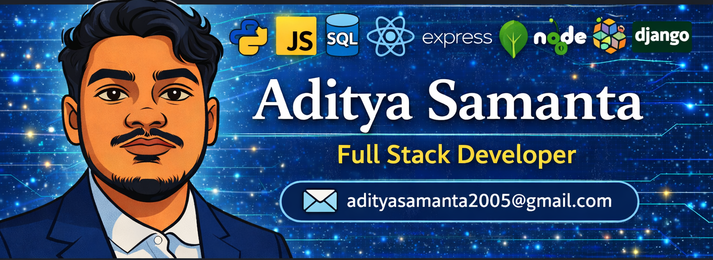

<h1 align="center">Hi 👋, I'm Aditya Samanta</h1>
<h3>🐍 Currently building scalable applications using Python Full Stack (Django + React)</h3>

<!-- Top Banner Image -->

  

💼 Computer Science Engineering Student at UEM Jaipur   

👨‍💻 Full Stack Developer passionate about building real-world projects  
🚀 Working with Python, JavaScript, React, Node, SQL & Django   

📫 <b>Let's connect!</b>  
<a href="https://www.linkedin.com/">LinkedIn</a> |
<a href="https://x.com/">X (Twitter)</a>
  

⚡ <b>Fun fact:</b> Do you know what <code>typeof NaN</code> returns in JavaScript?

